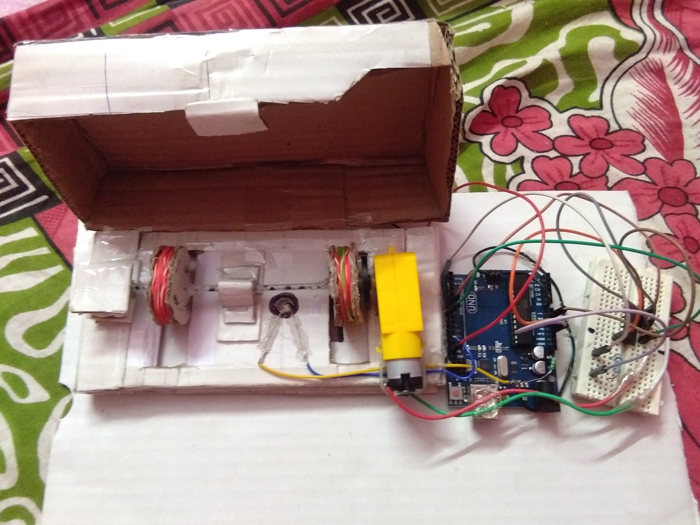

# Money-detector-amount-calculator
A hand made money detector machine which will classify different amount of Indian-note and after little bit modification it will be able to count the total amount of money. It is a small application of LDR sensor.

